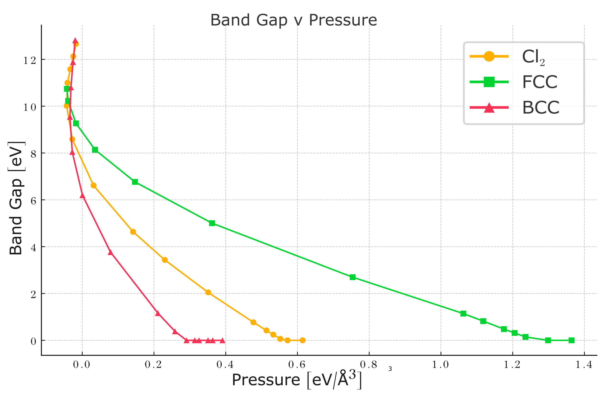

# Pressure-Induced Metallization of Solid Chlorine

DFT (FHI-aims) study of solid Cl in three phases — **molecular Cl₂**, **bcc**, and **fcc** — under compression. All three undergo an insulator-to-metal transition, with the metallization pressure depending strongly on structure.



| Phase | Metallization pressure |
|---|---|
| bcc | ~0.30 eV/ų (~48 GPa) |
| Cl₂ | ~0.55 eV/ų (~88 GPa) |
| fcc | ~1.30 eV/ų (~208 GPa) |

## Methods

PBE for geometry relaxations, M06-L for the EOS sweep, HSE06 for the final DOS (bcc only — fcc DOS used PBE). k-grid 12×12×12, 2-atom cubic cell.

## Layout

```
<phase>/eos_m06l/a_<lattice>/{scf,dos}/    # EOS sweep
<phase>/relax_pbe/{scf,dos}/               # geometry optimization
<phase>/dos_<xc>/                          # final DOS
```

See `migration_log.csv` for the mapping from the original folder names.
